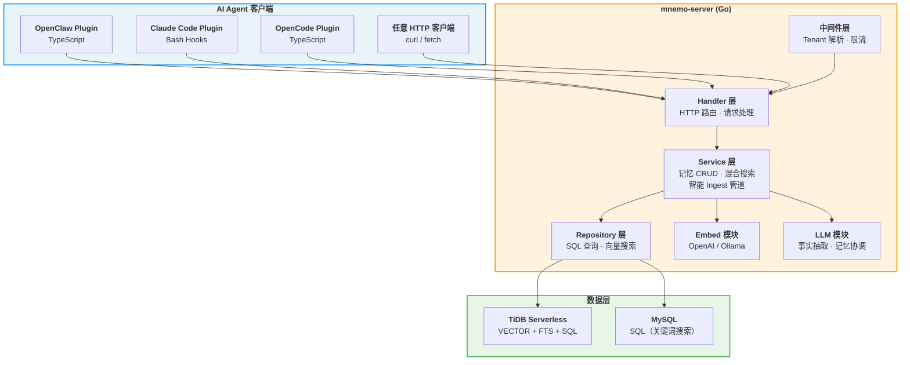
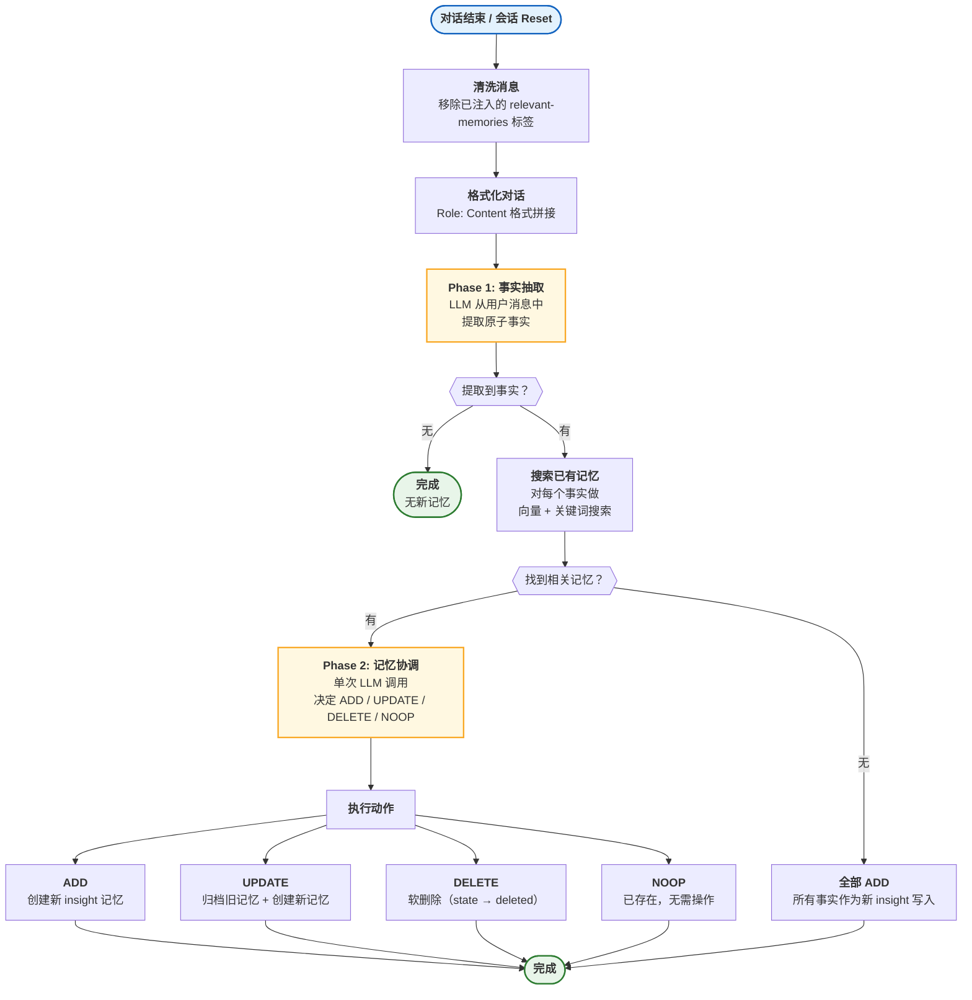
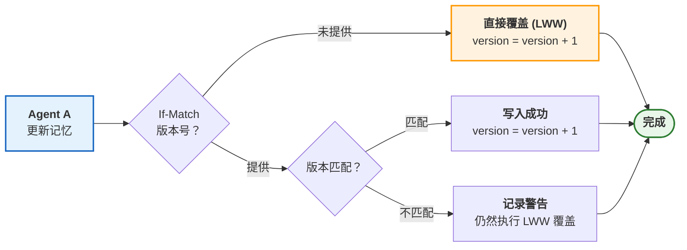
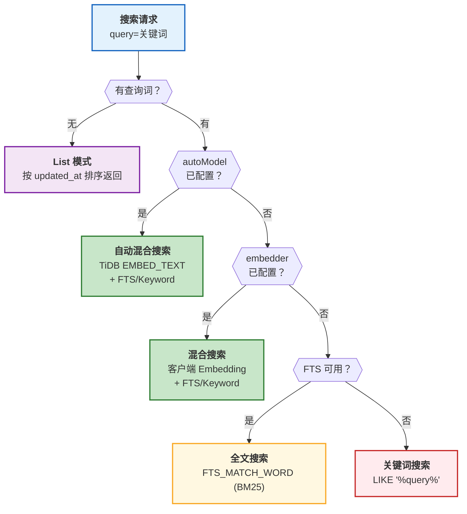
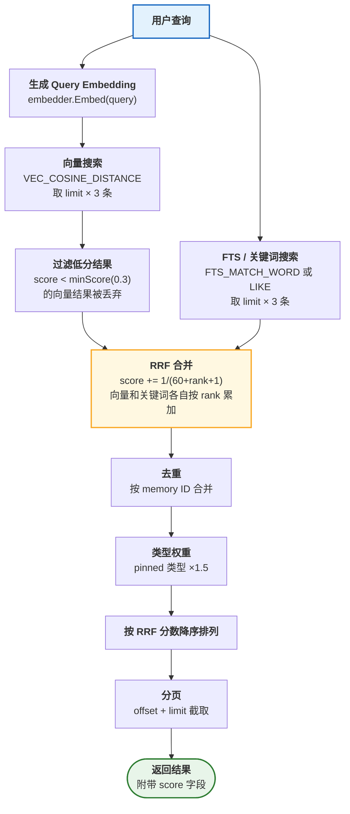
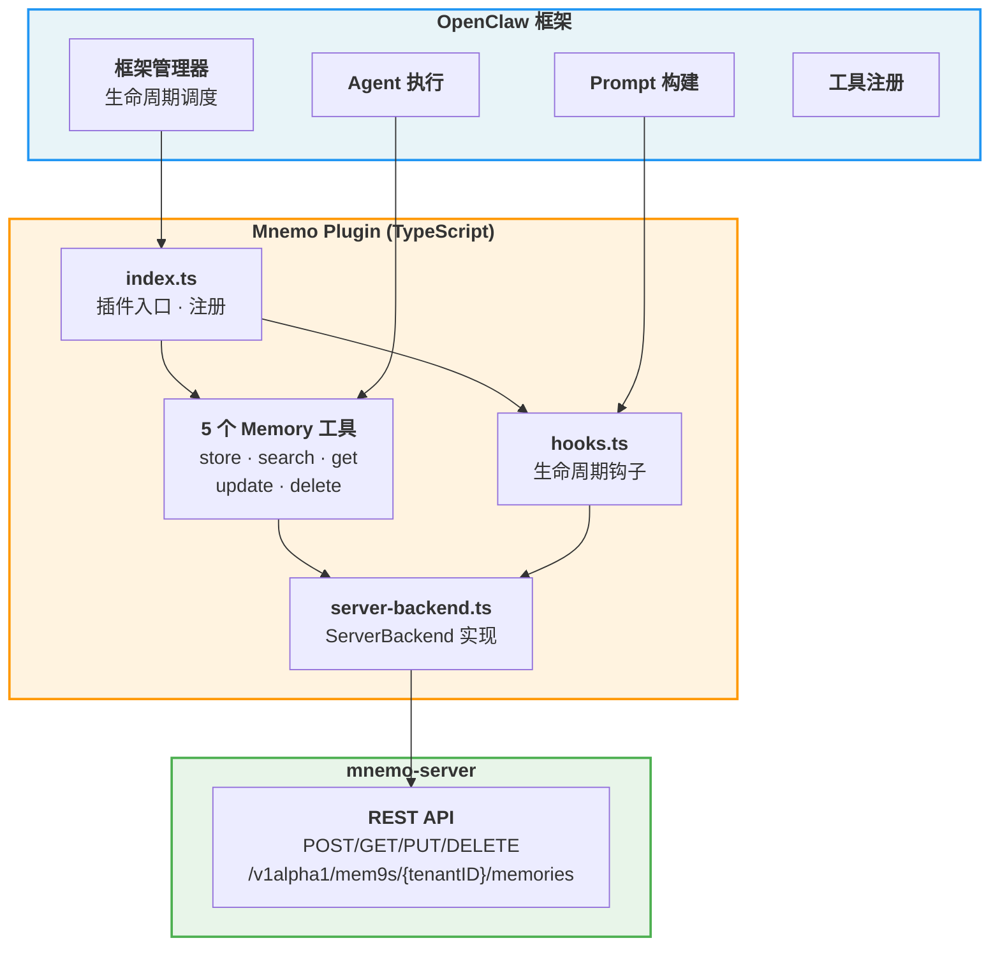
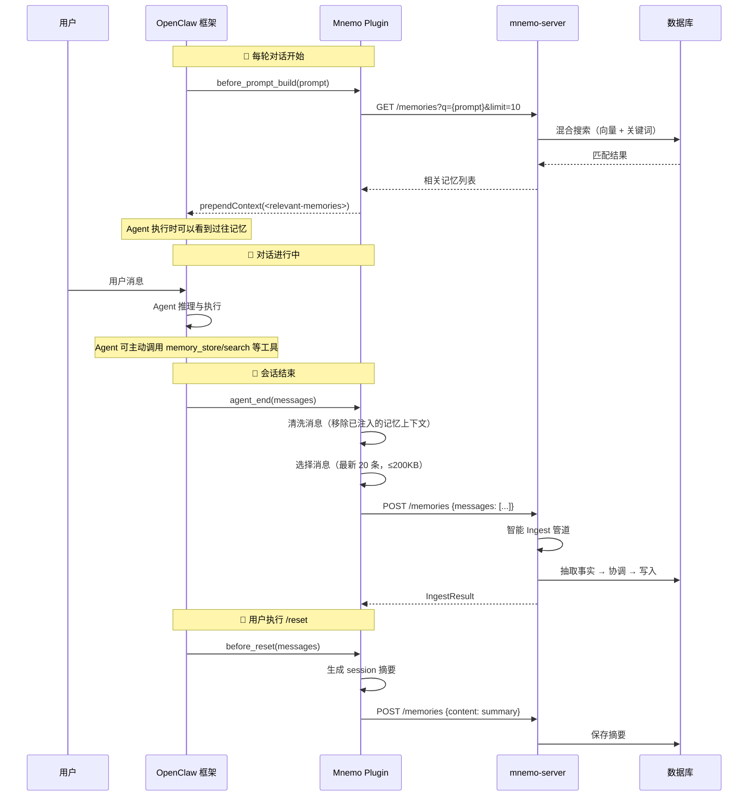
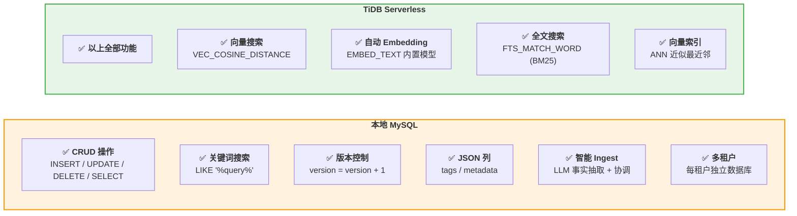

# Mnemos 架构与实现原理分析

> 基于源码分析的技术总结，涵盖长期记忆存储、混合搜索、OpenClaw 集成及 MySQL 兼容性。

---

## 目录

- [1. 系统总览](#1-系统总览)
- [2. 长期记忆如何保存](#2-长期记忆如何保存)
  - [2.1 智能 Ingest 管道](#21-智能-ingest-管道)
  - [2.2 事实抽取（Phase 1）](#22-事实抽取phase-1)
  - [2.3 记忆协调（Phase 2）](#23-记忆协调phase-2)
  - [2.4 版本控制与冲突解决](#24-版本控制与冲突解决)
- [3. 搜索如何工作](#3-搜索如何工作)
  - [3.1 搜索策略选择](#31-搜索策略选择)
  - [3.2 混合搜索算法（RRF）](#32-混合搜索算法rrf)
  - [3.3 向量搜索细节](#33-向量搜索细节)
  - [3.4 关键词搜索细节](#34-关键词搜索细节)
- [4. OpenClaw 集成使用指南](#4-openclaw-集成使用指南)
  - [4.1 插件架构](#41-插件架构)
  - [4.2 自动记忆生命周期](#42-自动记忆生命周期)
  - [4.3 安装与配置](#43-安装与配置)
- [5. 本地 MySQL 兼容性分析](#5-本地-mysql-兼容性分析)
- [6. 数据库 Schema](#6-数据库-schema)
- [7. 核心源码索引](#7-核心源码索引)

---

## 1. 系统总览

Mnemos 是 AI Agent 的**云持久化记忆系统**。核心理念：记忆应该是**自动的**，而非依赖 Agent 自行判断何时存取。



**分层架构**：`Handler → Service → Repository`，所有依赖通过接口注入，在 `main.go` 中手动组装（无框架 DI）。

**多租户隔离**：每个租户有独立的 TiDB Serverless 数据库实例，通过 URL 路径中的 `{tenantID}` 识别，中间件负责解析租户并从连接池获取对应的数据库连接。

---

## 2. 长期记忆如何保存

### 2.1 智能 Ingest 管道

Mnemos 的核心创新在于**两阶段智能 Ingest 管道**：不是简单地存储对话原文，而是通过 LLM 抽取原子事实并与已有记忆进行协调，避免重复和矛盾。



**源码路径**：`server/internal/service/ingest.go` — `Ingest()` 方法

### 2.2 事实抽取（Phase 1）

LLM 从对话中提取**原子事实**（每个事实一个独立的、自包含的陈述）：

- 仅从**用户消息**中提取，忽略 assistant 和 system 消息
- 保留用户原始语言（中文输入提取中文事实）
- 过滤掉临时性信息（问候语、调试聊天等）
- 单次对话最多提取 50 个事实

**返回格式**：`{"facts": ["事实一", "事实二", ...]}`

**源码路径**：`server/internal/service/ingest.go` — `extractFacts()` 方法

### 2.3 记忆协调（Phase 2）

协调阶段是避免记忆**膨胀和矛盾**的关键：

1. **搜索已有记忆**：对每个新事实分别做向量搜索 + 关键词搜索（每个事实最多 5 条），去重后上限 60 条
2. **ID 映射**：将真实 UUID 映射为整数 ID（`0, 1, 2...`），防止 LLM 幻觉出不存在的 ID
3. **单次 LLM 调用**：将所有新事实和已有记忆一起发给 LLM，返回每个事实的操作决策

| 动作 | 含义 | 执行方式 |
|------|------|----------|
| **ADD** | 全新信息 | 创建新 insight 记忆，生成 embedding |
| **UPDATE** | 更新已有记忆（更详细/更准确） | 归档旧记忆 + 创建新记忆（`ArchiveAndCreate`） |
| **DELETE** | 与已有记忆矛盾 | 软删除：`state → deleted` |
| **NOOP** | 已存在 | 不操作 |

**重要保护**：`pinned` 类型（用户手动保存）的记忆不会被自动 UPDATE 或 DELETE，UPDATE 时改为 ADD。

**源码路径**：`server/internal/service/ingest.go` — `reconcile()` 方法

### 2.4 版本控制与冲突解决



- **乐观锁**：`UpdateOptimistic` 支持 `expectedVersion` 参数，SQL 中添加 `AND version = ?` 条件
- **LWW（Last Writer Wins）**：版本冲突时记录日志但仍执行覆写，保证写入不会阻塞
- **原子版本递增**：SQL 中 `SET version = version + 1`，无并发竞态

**源码路径**：`server/internal/service/memory.go` — `Update()` 方法，`server/internal/repository/tidb/memory.go` — `UpdateOptimistic()`

---

## 3. 搜索如何工作

### 3.1 搜索策略选择

搜索系统采用**优雅降级**设计，根据可用的基础设施自动选择最佳搜索策略：



**搜索优先级**（从高到低）：

| 优先级 | 策略 | 条件 | 搜索质量 |
|--------|------|------|----------|
| 1 | 自动混合搜索 | `MNEMO_EMBED_AUTO_MODEL` 已配置 | 最高（TiDB 内置 embedding） |
| 2 | 混合搜索 | `MNEMO_EMBED_API_KEY` 已配置 | 高（客户端 embedding） |
| 3 | 全文搜索 | `MNEMO_FTS_ENABLED=true` 且 FTS 可用 | 中（BM25 评分） |
| 4 | 关键词搜索 | 默认 fallback | 低（子串匹配） |

**源码路径**：`server/internal/service/memory.go` — `Search()` 方法

### 3.2 混合搜索算法（RRF）

Mnemos 使用 **RRF（Reciprocal Rank Fusion，倒数排名融合）** 算法合并向量搜索和关键词搜索的结果：



**RRF 公式**：对每个结果的 ID，分别从向量排名和关键词排名中累加分数：

```
score(id) += 1 / (k + rank + 1)    其中 k = 60
```

这种方法的优势：
- 不依赖各搜索分支的原始分数（归一化问题）
- 同时出现在两个结果集中的记忆自然获得更高分
- `pinned` 类型记忆额外获得 1.5x 权重提升

**源码路径**：`server/internal/service/memory.go` — `rrfMerge()`、`hybridSearch()` 方法

### 3.3 向量搜索细节

**三种向量搜索模式**：

| 模式 | SQL 函数 | Embedding 来源 | 使用场景 |
|------|----------|----------------|----------|
| 客户端向量搜索 | `VEC_COSINE_DISTANCE(embedding, ?)` | 服务端调用 OpenAI/Ollama | 自建 embedding 服务 |
| 自动向量搜索 | `VEC_EMBED_COSINE_DISTANCE(embedding, ?)` | TiDB 内置 EMBED_TEXT | TiDB Cloud Serverless |
| 无向量搜索 | — | — | 未配置 embedding |

**关键约束**（TiDB 特有）：
- `VEC_COSINE_DISTANCE` 在 SELECT 和 ORDER BY 中**必须完全一致**，否则无法使用 VECTOR INDEX
- `WHERE embedding IS NOT NULL` 是必须条件
- Score 计算：`score = 1 - distance`（余弦距离转相似度）

**源码路径**：`server/internal/repository/tidb/memory.go` — `VectorSearch()`、`AutoVectorSearch()`

### 3.4 关键词搜索细节

| 搜索类型 | SQL | 评分 | 条件 |
|----------|-----|------|------|
| FTS 全文搜索 | `fts_match_word('query', content)` | BM25 原生评分 | `MNEMO_FTS_ENABLED=true` |
| LIKE 关键词搜索 | `content LIKE CONCAT('%', ?, '%')` | 按 `updated_at` 排序 | 默认 fallback |

FTS 使用 TiDB 的 `MULTILINGUAL` 分词器，天然支持中文。但由于 TiDB 的 FTS 不支持参数化查询，代码通过 `ftsSafeLiteral` 函数进行转义后内联到 SQL 中。

**源码路径**：`server/internal/repository/tidb/memory.go` — `FTSSearch()`、`KeywordSearch()`

---

## 4. OpenClaw 集成使用指南

### 4.1 插件架构

Mnemos 以 `kind: "memory"` 插件形式集成到 OpenClaw，**替代内置的记忆提供者**：



**为什么用 Plugin 而非 Skill？**

| 对比 | Plugin (`kind: "memory"`) | Skill |
|------|--------------------------|-------|
| 触发方式 | 框架自动调用 | Agent 自行决定 |
| 可靠性 | 保证执行 | 依赖 Agent 判断 |
| 集成方式 | 替代内置 memory 工具 | 额外新增工具 |

### 4.2 自动记忆生命周期



**三个生命周期钩子**：

| 钩子 | 触发时机 | 行为 |
|------|----------|------|
| `before_prompt_build` | 每次构建 prompt 前 | 搜索相关记忆 → 注入 prompt 上下文 |
| `agent_end` | 会话结束 | 选择消息 → 调用智能 Ingest 管道 |
| `before_reset` | 用户 `/reset` | 生成 session 摘要 → 存储 |

**记忆格式化**：搜索到的记忆按类型分组展示：
- `[Preferences]` — `pinned` 类型（用户手动保存的偏好）
- `[Knowledge]` — `insight` 类型（自动抽取的知识）

### 4.3 安装与配置

**前提条件**：运行中的 mnemo-server 实例。

**步骤 1：创建租户**

```bash
curl -s -X POST http://<server>/v1alpha1/mem9s | jq .
# → { "id": "xxxxxxxx-xxxx-xxxx-xxxx-xxxxxxxxxxxx", "claim_url": "..." }
```

**步骤 2：配置 OpenClaw**

在 `openclaw.json` 中添加：

```json
{
  "plugins": {
    "slots": { "memory": "mnemo" },
    "entries": {
      "mnemo": {
        "enabled": true,
        "config": {
          "apiUrl": "http://localhost:8080",
          "tenantID": "你的租户ID"
        }
      }
    }
  }
}
```

**步骤 3：启动 OpenClaw**

插件自动加载，日志中出现 `[mnemo] Server mode (mnemo-server REST API)` 表示启用成功。

**暴露的 5 个工具**：

| 工具 | 功能 |
|------|------|
| `memory_store` | 存储记忆（content + 可选 tags/metadata） |
| `memory_search` | 混合搜索（q + 可选 tags/source/limit） |
| `memory_get` | 按 ID 获取单条记忆 |
| `memory_update` | 更新已有记忆 |
| `memory_delete` | 删除记忆 |

---

## 5. 本地 MySQL 兼容性分析



### 功能对比详表

| 功能 | TiDB Serverless | 本地 MySQL | 说明 |
|------|:-:|:-:|------|
| 记忆 CRUD | ✅ | ✅ | 标准 SQL，完全兼容 |
| 版本控制（LWW） | ✅ | ✅ | 原子 `version = version + 1` |
| JSON 列（tags/metadata） | ✅ | ✅ | MySQL 5.7+ 支持 `JSON_CONTAINS` |
| 关键词搜索（LIKE） | ✅ | ✅ | 兜底搜索策略，始终可用 |
| 智能 Ingest 管道 | ✅ | ✅ | LLM 调用不依赖数据库类型 |
| 多租户隔离 | ✅ | ✅ | 每租户独立数据库 |
| **向量搜索** | ✅ | ❌ | 需要 `VECTOR` 类型和 `VEC_COSINE_DISTANCE` |
| **自动 Embedding** | ✅ | ❌ | 需要 TiDB 的 `EMBED_TEXT` 函数 |
| **全文搜索（BM25）** | ✅ | ❌ | 需要 TiDB 的 `FTS_MATCH_WORD` |
| **向量索引（ANN）** | ✅ | ❌ | 需要 TiFlash |

### 使用本地 MySQL 的影响

**可以正常使用的功能**：
- 所有记忆 CRUD 操作
- 智能 Ingest 管道（LLM 事实抽取 + 记忆协调）
- 关键词子串搜索（`LIKE '%query%'`）
- 版本控制和冲突解决
- 所有 OpenClaw/Claude Code/OpenCode 插件的生命周期钩子

**不可用的功能**：
- 向量语义搜索 — 只能通过关键词匹配，无法理解语义相似性
- 自动 Embedding — 需要外部 embedding 服务配合，且 MySQL 无法存储向量
- BM25 全文搜索 — 只能退化为 LIKE 子串匹配

**底线结论**：本地 MySQL **可以使用 mnemos 的大部分核心功能**，包括最关键的智能 Ingest 管道（自动记忆管理）。搜索质量会降低（仅关键词匹配），但不影响系统的基本运转。如果搜索质量重要，建议配置外部 Embedding 服务（OpenAI/Ollama）+ 使用 TiDB Serverless 免费版。

### 配置示例（本地 MySQL）

```bash
# 最小配置 — 仅关键词搜索
export MNEMO_DSN="root:password@tcp(127.0.0.1:3306)/mnemos?parseTime=true"

# 推荐配置 — 加上 LLM 实现智能 Ingest
export MNEMO_DSN="root:password@tcp(127.0.0.1:3306)/mnemos?parseTime=true"
export MNEMO_LLM_API_KEY="sk-..."       # 智能事实抽取
export MNEMO_LLM_MODEL="gpt-4o-mini"    # 协调模型

# 注意：以下配置在 MySQL 上不生效
# MNEMO_EMBED_AUTO_MODEL — 需要 TiDB EMBED_TEXT
# MNEMO_FTS_ENABLED — 需要 TiDB FTS_MATCH_WORD
# MNEMO_EMBED_API_KEY — 虽然能生成 embedding，但 MySQL 无法存储 VECTOR 类型
```

> **注意**：`VECTOR(1536)` 类型在建表时可能报错。需要修改 schema，将 `embedding VECTOR(1536) NULL` 替换为一般的列类型或直接移除。建议使用 TiDB Serverless（免费版即可）以获得完整功能。

---

## 6. 数据库 Schema

### 核心表：memories（租户数据面）

```sql
CREATE TABLE IF NOT EXISTS memories (
  id              VARCHAR(36)     PRIMARY KEY,
  content         MEDIUMTEXT      NOT NULL,
  source          VARCHAR(100),
  tags            JSON,
  metadata        JSON,
  embedding       VECTOR(1536)    NULL,          -- TiDB 专属，MySQL 不支持

  memory_type     VARCHAR(20)     NOT NULL DEFAULT 'pinned',  -- pinned | insight | digest
  agent_id        VARCHAR(100)    NULL,
  session_id      VARCHAR(100)    NULL,
  state           VARCHAR(20)     NOT NULL DEFAULT 'active',  -- active | paused | archived | deleted
  version         INT             DEFAULT 1,
  updated_by      VARCHAR(100),
  created_at      TIMESTAMP       DEFAULT CURRENT_TIMESTAMP,
  updated_at      TIMESTAMP       DEFAULT CURRENT_TIMESTAMP ON UPDATE CURRENT_TIMESTAMP,
  superseded_by   VARCHAR(36)     NULL            -- UPDATE 操作时指向新记忆 ID
);
```

### 控制面表：tenants + tenant_tokens

```sql
-- 租户注册
CREATE TABLE IF NOT EXISTS tenants (
  id              VARCHAR(36)   PRIMARY KEY,
  name            VARCHAR(255)  NOT NULL,
  db_host         VARCHAR(255)  NOT NULL,       -- 租户数据库连接信息
  -- ... 其他连接字段 ...
  status          VARCHAR(20)   NOT NULL DEFAULT 'provisioning',
  schema_version  INT           NOT NULL DEFAULT 1
);

-- 租户 API Token
CREATE TABLE IF NOT EXISTS tenant_tokens (
  api_token       VARCHAR(64)   PRIMARY KEY,
  tenant_id       VARCHAR(36)   NOT NULL
);
```

---

## 7. 核心源码索引

| 模块 | 文件路径 | 核心职责 |
|------|----------|----------|
| **入口与 DI** | `server/cmd/mnemo-server/main.go` | 配置加载、依赖注入、优雅关闭 |
| **配置** | `server/internal/config/config.go` | 环境变量加载（DSN、Embedding、LLM、FTS 等） |
| **核心类型** | `server/internal/domain/types.go` | Memory、MemoryFilter、AuthInfo 类型定义 |
| **错误定义** | `server/internal/domain/errors.go` | ErrNotFound、ErrConflict 等哨兵错误 |
| **HTTP 路由** | `server/internal/handler/handler.go` | chi 路由注册、服务解析缓存 |
| **记忆 Handler** | `server/internal/handler/memory.go` | CRUD HTTP 处理、异步 Ingest |
| **记忆 Service** | `server/internal/service/memory.go` | 混合搜索（RRF）、LWW 更新、BulkCreate |
| **Ingest 管道** | `server/internal/service/ingest.go` | 事实抽取、记忆协调、ADD/UPDATE/DELETE |
| **Repository** | `server/internal/repository/tidb/memory.go` | SQL 实现：VectorSearch、FTSSearch、KeywordSearch |
| **Embedding** | `server/internal/embed/embedder.go` | OpenAI 兼容 API 客户端，nullable 设计 |
| **LLM 客户端** | `server/internal/llm/client.go` | Chat Completions 调用，JSON 模式 |
| **Tenant 中间件** | `server/internal/middleware/auth.go` | URL 租户解析、DB 连接池获取 |
| **限流** | `server/internal/middleware/ratelimit.go` | 按 IP 限流，自动清理过期 visitor |
| **OpenClaw 插件** | `openclaw-plugin/index.ts` | 工具注册、钩子绑定、LazyServerBackend |
| **OpenClaw 后端** | `openclaw-plugin/server-backend.ts` | HTTP → mnemo API 映射 |
| **OpenClaw 钩子** | `openclaw-plugin/hooks.ts` | auto-recall、auto-capture 实现 |
| **OpenCode 插件** | `opencode-plugin/src/index.ts` | 插件入口、配置加载 |
| **Schema** | `server/schema.sql` | 完整 DDL（控制面 + 数据面） |
