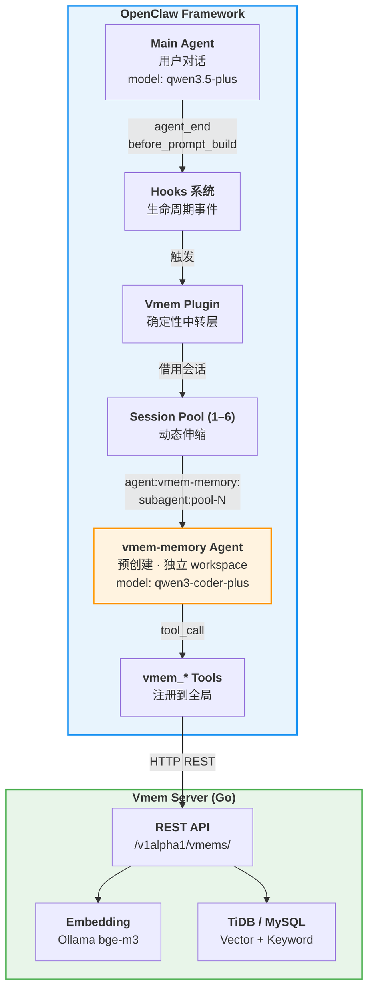
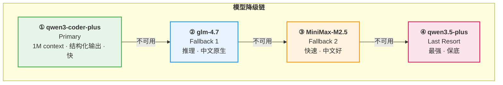
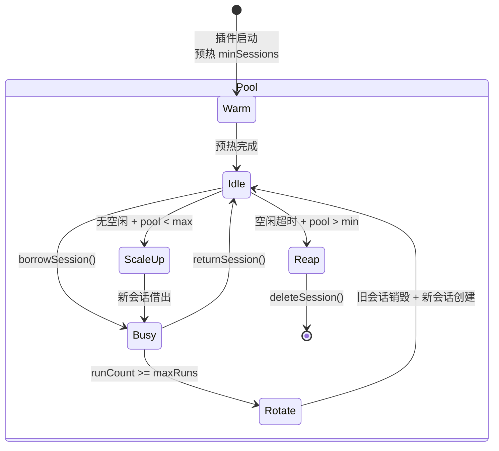
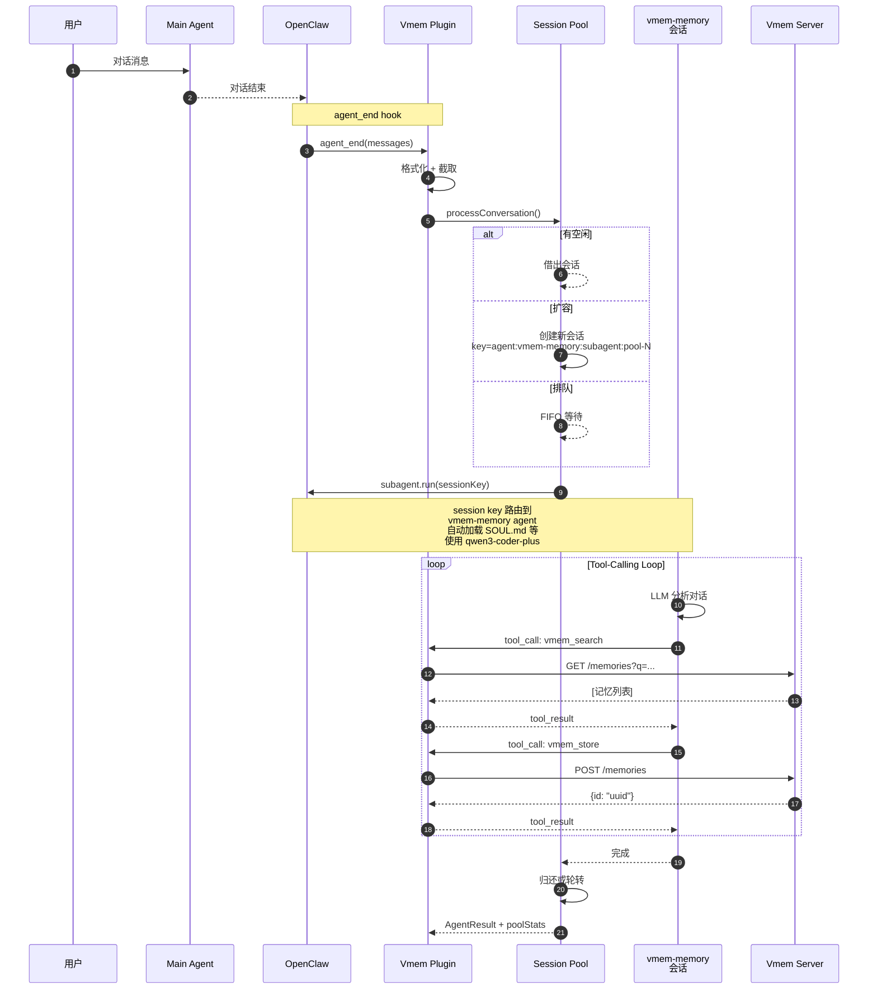
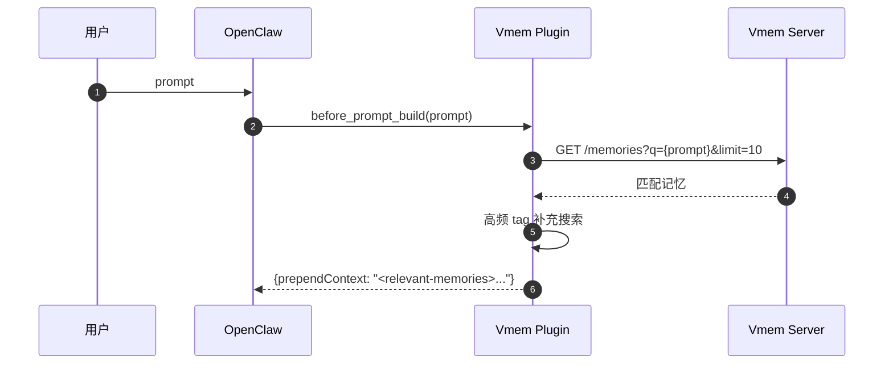
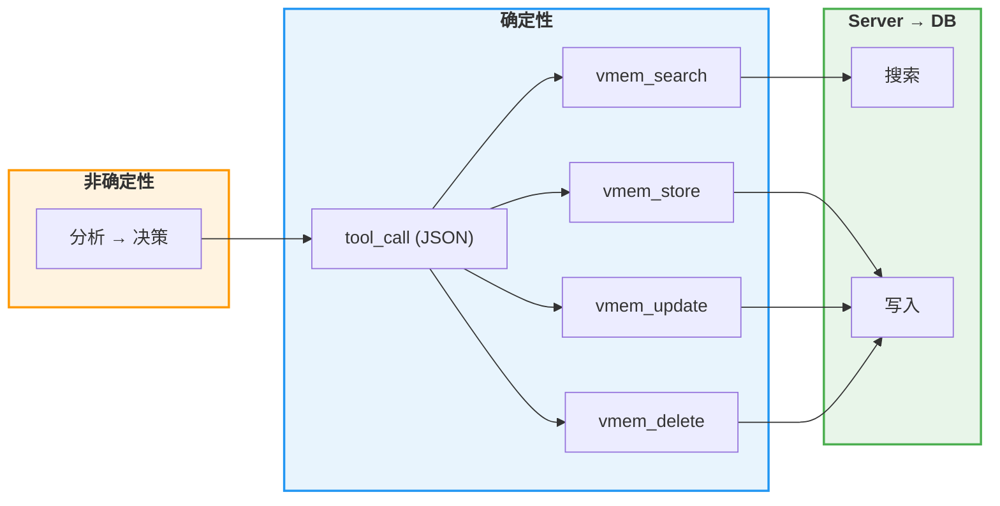

# Vmem 架构文档

## 1. 系统全景



## 2. 为什么是预创建 Agent？

| 方案 | 问题 |
|------|------|
| 每次 `subagent.run()` 创建/销毁 | session 创建开销、bootstrap 加载、LLM 冷启动、无上下文积累 |
| 动态创建 + session 复用 | session 无 agent 身份，需注入 extraSystemPrompt，无独立模型配置 |
| **预创建 Agent + session 池（当前方案）** | ✅ 独立 workspace（bootstrap 文件自动加载）<br/>✅ 独立模型配置（用便宜/快速模型）<br/>✅ CLI 可管理（`openclaw agents list`）<br/>✅ session 复用，上下文积累<br/>✅ 动态伸缩 |

### 关键机制：Session Key 路由

```
session key: agent:vmem-memory:subagent:pool-1
                    ↑
          deriveAgentFromSessionKey()
          解析出 "vmem-memory" → 路由到该 agent 的:
            - workspace (SOUL.md, IDENTITY.md, ...)
            - model (qwen3-coder-plus + fallbacks)
            - agentDir (状态、认证)
```

## 3. 模型降级策略

Memory Agent 需要：**tool-calling 可靠** + **中文理解** + **低延迟** + **结构化输出**。

基于 [Coding Plan 模型](https://help.aliyun.com/zh/model-studio/openclaw-coding-plan)：



| 模型 | 为什么选它 | Context | 输出 |
|------|-----------|---------|------|
| `qwen3-coder-plus` | 结构化输出专长，tool-calling 最稳定，最快 | 1M | 65K |
| `glm-4.7` | 推理能力强，中文原生支持 | 202K | 16K |
| `MiniMax-M2.5` | 响应速度快，中文好 | 196K | 32K |
| `qwen3.5-plus` | 最强综合能力，作为保底 | 1M | 65K |

### 配置方式

**方式一：Agent 级别（推荐）** — 在 `agents.list[]` 中配置：

```json
{
  "model": {
    "primary": "bailian/qwen3-coder-plus",
    "fallbacks": ["bailian/glm-4.7", "bailian/MiniMax-M2.5", "bailian/qwen3.5-plus"]
  }
}
```

**方式二：Plugin 级别** — 通过 `before_model_resolve` hook 动态覆盖：

```json
{
  "config": {
    "modelFallbackChain": ["bailian/qwen3-coder-plus", "bailian/glm-4.7"]
  }
}
```

## 4. Session 池 — 动态伸缩



| 触发 | 动作 |
|------|------|
| 请求到达 + 有空闲 | 借出最久未用的会话 |
| 请求到达 + 无空闲 + pool < max | **扩容** |
| 请求到达 + 无空闲 + pool == max | **排队** (FIFO) |
| runCount >= maxRunsPerSession | **轮转**（防止上下文溢出） |
| 空闲 > idleReapMs + pool > min | **缩容** |

## 5. 核心流程：自动记忆捕获 (agent_end)



## 6. 核心流程：记忆召回 (before_prompt_build)



## 7. 确定性保证



## 8. 安装

### Step 1: 安装 Vmem 插件

```bash
openclaw plugins install vmem
```

### Step 2: 创建 Memory Agent

```bash
# 一键设置（复制 bootstrap 文件到 agent workspace）
bash openclaw-plugin/scripts/setup-agent.sh

# 或手动创建
openclaw agents add "Vmem Memory" \
  --workspace ~/.openclaw/workspace-vmem-memory \
  --model bailian/qwen3-coder-plus
```

### Step 3: 配置 openclaw.json

```json
{
  "agents": {
    "list": [
      {
        "id": "vmem-memory",
        "name": "Vmem Memory",
        "workspace": "~/.openclaw/workspace-vmem-memory",
        "model": {
          "primary": "bailian/qwen3-coder-plus",
          "fallbacks": [
            "bailian/glm-4.7",
            "bailian/MiniMax-M2.5",
            "bailian/qwen3.5-plus"
          ]
        },
        "subagents": { "allowAgents": ["*"] }
      }
    ]
  },
  "plugins": {
    "slots": { "memory": "vmem" },
    "entries": {
      "vmem": {
        "enabled": true,
        "config": {
          "apiUrl": "http://localhost:8080",
          "tenantID": "your-tenant-uuid"
        }
      }
    }
  }
}
```

### Step 4: 重启

```bash
openclaw gateway restart
```

## 9. Agent Workspace 文件

```
~/.openclaw/workspace-vmem-memory/
├── SOUL.md       ← 人设、决策框架、标签规范
├── IDENTITY.md   ← 身份：Vmem, 后台 Agent
├── AGENTS.md     ← 操作指令、工作流、红线
├── TOOLS.md      ← vmem_* 工具说明
└── USER.md       ← 用户上下文（语言偏好）
```

这些文件由 OpenClaw 自动加载到 `vmem-memory` agent 的 system prompt 中，不需要 `extraSystemPrompt` 注入。

## 10. 配置参考

### Session 池调优

| 参数 | 默认 | 说明 |
|------|------|------|
| `agentMinSessions` | 1 | 始终保持的热会话 |
| `agentMaxSessions` | 6 | 池可扩展到的上限 |
| `agentMaxRunsPerSession` | 50 | 会话轮转阈值 |
| `agentRunTimeoutMs` | 120000 | 单次运行超时 |
| `agentIdleReapMs` | 60000 | 空闲回收阈值 |

### 场景配置

| 场景 | min | max | 推荐模型 |
|------|-----|-----|---------|
| 个人 | 1 | 2 | qwen3-coder-plus |
| 小团队 | 2 | 4 | qwen3-coder-plus |
| 高并发 | 4 | 8 | qwen3-coder-plus + glm-4.7 fallback |

### Server 环境变量

```bash
MNEMO_DSN="user:pass@tcp(host:4000)/vmems?parseTime=true"
MNEMO_EMBED_BASE_URL=http://localhost:11434/v1
MNEMO_EMBED_MODEL=bge-m3
MNEMO_EMBED_DIMS=1024
MNEMO_EMBED_API_KEY=ollama
```
