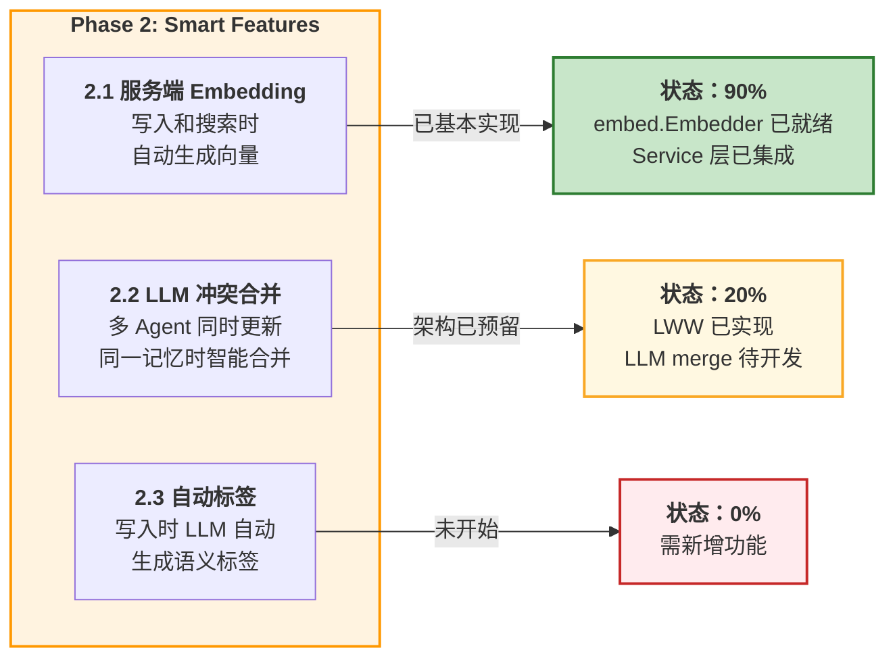
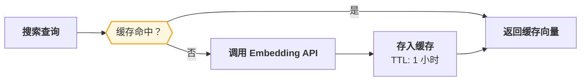
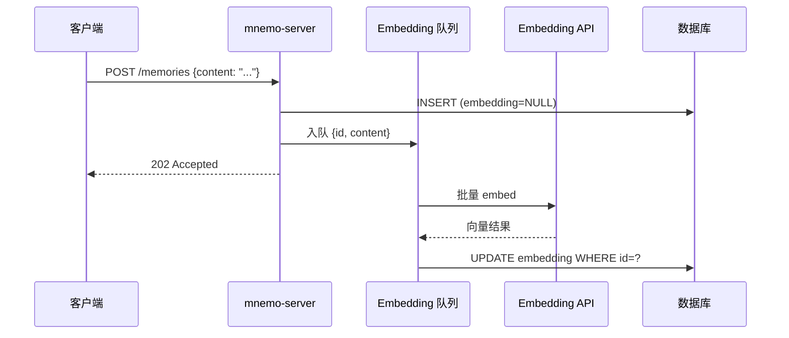
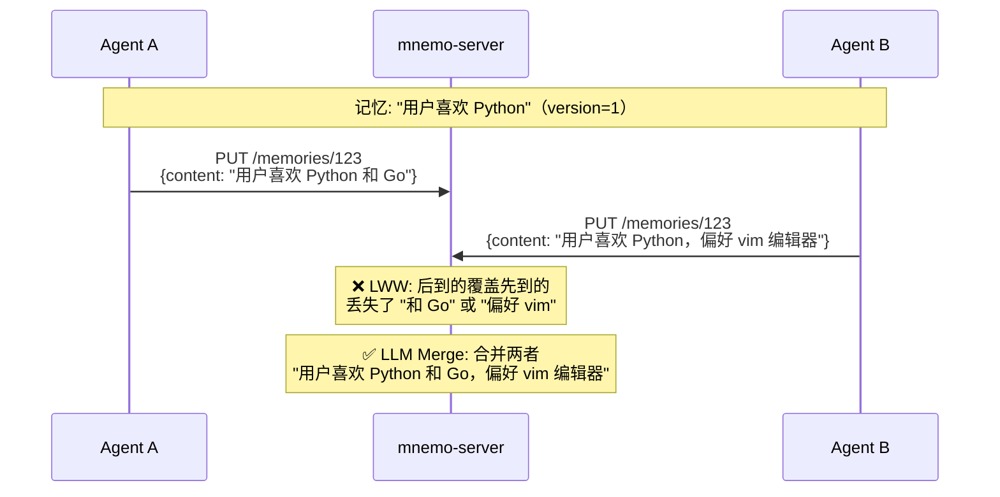
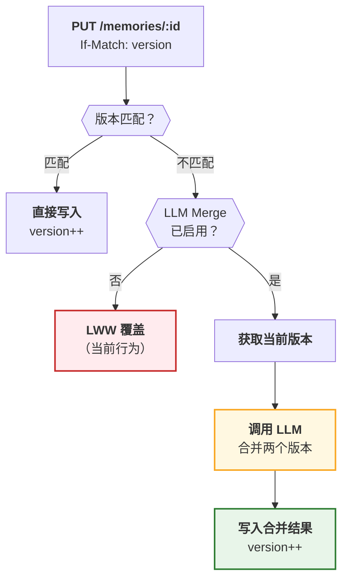
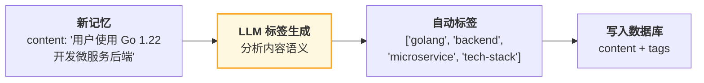
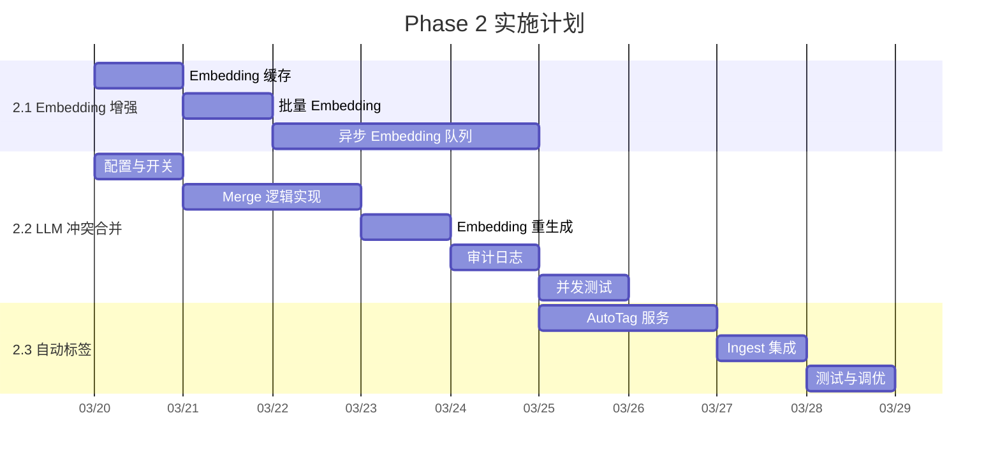

# Phase 2: Smart Features 实施方案

> 覆盖三个核心功能：服务端 Embedding 生成、LLM 冲突合并、写入时自动标签。

---

## 目录

- [1. 总览](#1-总览)
- [2. 服务端 Embedding 生成](#2-服务端-embedding-生成)
- [3. LLM 冲突合并](#3-llm-冲突合并)
- [4. 写入时自动标签](#4-写入时自动标签)
- [5. 实施路线图](#5-实施路线图)

---

## 1. 总览



---

## 2. 服务端 Embedding 生成

### 2.1 当前状态

**已基本实现**。核心组件均已就绪：

| 组件 | 文件 | 状态 |
|------|------|------|
| Embedding 客户端 | `server/internal/embed/embedder.go` | ✅ OpenAI 兼容 API |
| 写入时 embed | `server/internal/service/ingest.go` | ✅ Create/Update 前生成 |
| 搜索时 embed | `server/internal/service/memory.go` | ✅ hybridSearch 中生成 |
| Nullable 设计 | 全局 | ✅ embedder=nil 时优雅降级 |
| TiDB Auto Embedding | `MNEMO_EMBED_AUTO_MODEL` | ✅ GENERATED 列支持 |

### 2.2 待改进点

#### a) Embedding 缓存

当前每次搜索都重新调用 embedding API。对于相同或相似的查询，可以缓存结果。



**实施方案**：

```go
// embed/embedder.go — 新增 LRU 缓存
type Embedder struct {
    // ... existing fields
    cache *lru.Cache[string, []float32] // query → embedding
}

func (e *Embedder) Embed(ctx context.Context, text string) ([]float32, error) {
    key := e.Model + ":" + text
    if cached, ok := e.cache.Get(key); ok {
        return cached, nil
    }
    vec, err := e.callAPI(ctx, text)
    if err != nil {
        return nil, err
    }
    e.cache.Add(key, vec)
    return vec, nil
}
```

**预计工作量**：0.5 天

#### b) 批量 Embedding

BulkCreate 时逐条调用 embedding API 效率低下。OpenAI API 支持批量 embedding。

```go
// embed/embedder.go — 新增批量接口
func (e *Embedder) EmbedBatch(ctx context.Context, texts []string) ([][]float32, error) {
    // OpenAI /v1/embeddings 支持 input 为数组
    // 一次调用嵌入多条文本
}
```

**预计工作量**：1 天

#### c) 异步 Embedding 队列

写入时同步调用 embedding API 会增加请求延迟。可以改为异步：



**预计工作量**：3 天（需要后台 worker + 队列机制）

---

## 3. LLM 冲突合并

### 3.1 问题场景

当多个 Agent 同时更新同一条记忆时，当前采用 LWW（Last Writer Wins）——后写覆盖前写，可能丢失信息。



### 3.2 设计方案



### 3.3 LLM Merge Prompt 设计

```go
const mergeSystemPrompt = `You are a memory merge engine. Two agents updated the same memory concurrently.
Merge both versions into one coherent, non-redundant memory.

Rules:
1. Preserve ALL important information from both versions
2. Remove exact duplicates
3. If facts conflict, keep the more specific/recent one
4. Preserve the original language
5. Keep it concise — no unnecessary elaboration

Return ONLY the merged text, no explanation.`

func buildMergeUserPrompt(current, incoming string) string {
    return fmt.Sprintf(
        "Current version:\n%s\n\nIncoming version:\n%s\n\nMerged result:",
        current, incoming,
    )
}
```

### 3.4 实施步骤

| 步骤 | 内容 | 工作量 |
|------|------|--------|
| 1 | 在 `config.go` 添加 `MNEMO_MERGE_ENABLED` 开关 | 0.5 天 |
| 2 | 在 `service/memory.go` 的 `Update` 方法中添加 merge 分支 | 1 天 |
| 3 | 创建 `service/merge.go` 实现 LLM merge 逻辑 | 1 天 |
| 4 | merge 后重新生成 embedding | 0.5 天 |
| 5 | 保存 merge 历史（审计日志） | 1 天 |
| 6 | 测试：并发更新场景 | 1 天 |

**总计**：~5 天

### 3.5 关键实现

```go
// service/memory.go — Update 方法增强
func (s *MemoryService) Update(ctx context.Context, agentName, id, content string, ...) (*domain.Memory, error) {
    current, err := s.memories.GetByID(ctx, id)
    // ...

    if ifMatch > 0 && ifMatch != current.Version {
        if s.mergeEnabled && s.llmClient != nil {
            merged, mergeErr := s.mergeConflict(ctx, current.Content, content)
            if mergeErr == nil {
                content = merged
                slog.Info("LLM merge applied",
                    "memory_id", id,
                    "agent", agentName,
                )
            }
        }
        // fallback to LWW if merge fails
    }

    // ... rest of update logic
}
```

---

## 4. 写入时自动标签

### 4.1 功能说明

当 Agent 存储记忆时，LLM 自动为内容生成语义标签，便于后续过滤和分类。



### 4.2 Prompt 设计

```go
const autoTagSystemPrompt = `You are a tagging engine. Given a memory text, generate 2-5 concise tags.

Rules:
1. Tags should be lowercase, hyphenated (e.g., "tech-stack", "user-preference")
2. Tags should be semantic categories, not just keywords
3. Preserve the language of the content for language-specific tags
4. Standard category tags should be in English
5. Return as JSON array

Categories to consider:
- tech-stack, language, framework, tool
- user-preference, workflow, habit
- project, team, organization
- debugging, performance, architecture
- personal-info, contact, location

Return ONLY valid JSON: ["tag1", "tag2", ...]`
```

### 4.3 实施步骤

| 步骤 | 内容 | 工作量 |
|------|------|--------|
| 1 | 在 `config.go` 添加 `MNEMO_AUTO_TAG_ENABLED` 开关 | 0.5 天 |
| 2 | 创建 `service/autotag.go` 实现 LLM 标签生成 | 1 天 |
| 3 | 在 `ingest.go` 的 `addInsight` 中集成自动标签 | 0.5 天 |
| 4 | 标签合并逻辑：自动标签 + 用户手动标签 | 0.5 天 |
| 5 | 测试 | 0.5 天 |

**总计**：~3 天

### 4.4 关键设计决策

- **异步 vs 同步**：自动标签在 ingest 管道中同步执行（已在 LLM 调用链中），不增加额外延迟
- **覆盖 vs 合并**：自动标签与用户标签合并（union），用户标签优先级更高
- **pinned 记忆**：用户手动存储的 pinned 记忆也自动打标签，但不会覆盖已有标签
- **成本控制**：可以用 `gpt-4o-mini` 等低成本模型，每次 ~100 token

---

## 5. 实施路线图



**总工作量估算**：~13 天

**优先级排序**：
1. **Embedding 缓存**（低成本高收益，减少 API 调用费用）
2. **LLM 冲突合并**（多 Agent 协作场景的核心需求）
3. **自动标签**（提升搜索过滤体验）
4. **批量 Embedding**（优化大量导入性能）
5. **异步 Embedding 队列**（可选，极致性能优化）
