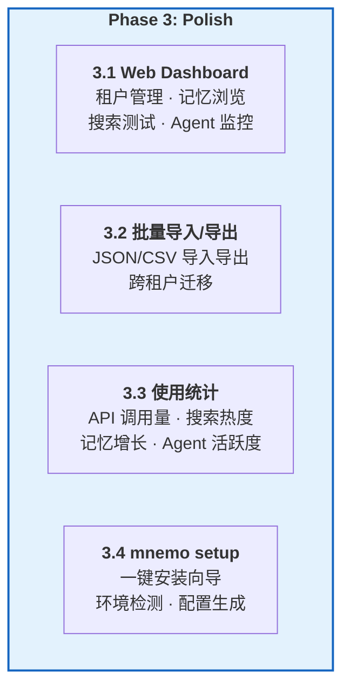
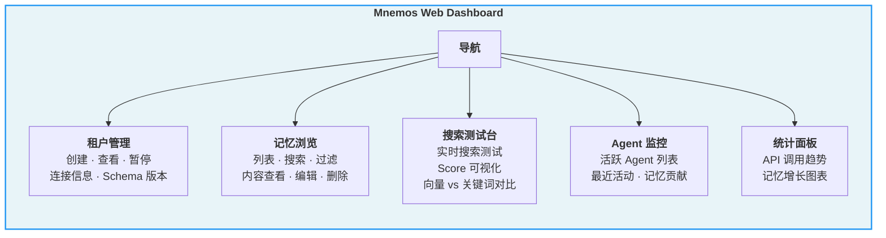
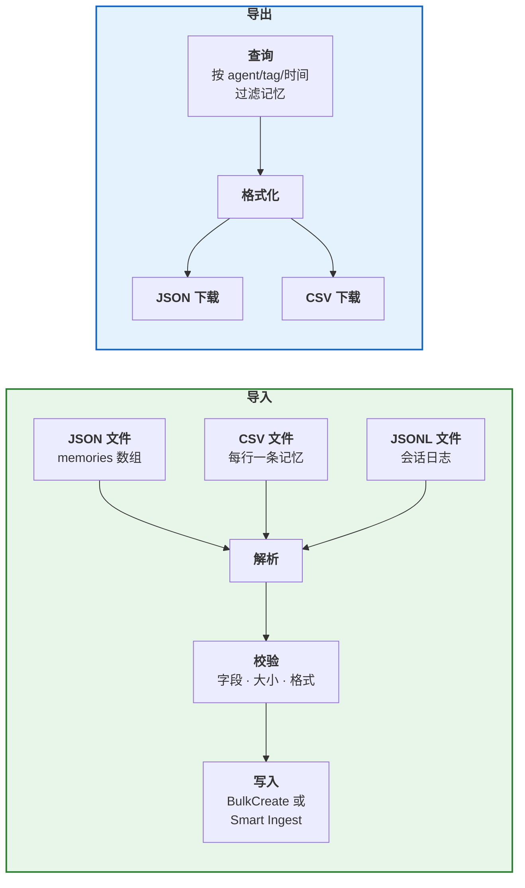
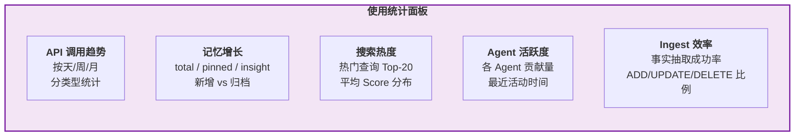
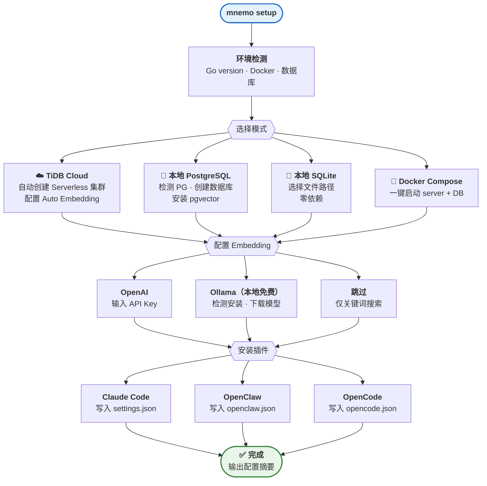
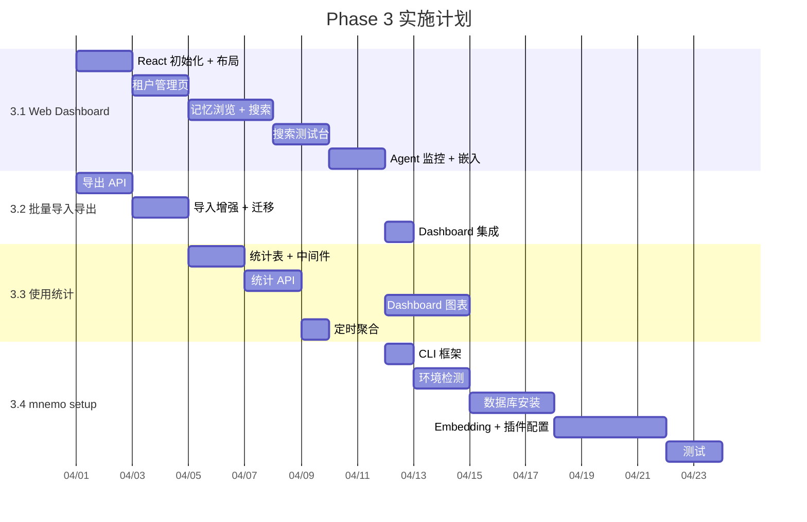

# Phase 3: Polish 实施方案

> 覆盖四个功能：Web Dashboard、批量导入导出、使用统计分析、CLI 安装向导。

---

## 目录

- [1. 总览](#1-总览)
- [2. Web Dashboard](#2-web-dashboard)
- [3. 批量导入/导出](#3-批量导入导出)
- [4. 使用统计分析](#4-使用统计分析)
- [5. mnemo setup CLI 向导](#5-mnemo-setup-cli-向导)
- [6. 实施路线图](#6-实施路线图)

---

## 1. 总览



---

## 2. Web Dashboard

### 2.1 功能概览



### 2.2 技术选型

| 组件 | 选择 | 理由 |
|------|------|------|
| **前端框架** | React + Vite | 生态成熟，构建快 |
| **UI 组件库** | shadcn/ui + Tailwind | 现代化、轻量、可定制 |
| **图表** | Recharts | React 原生，API 简洁 |
| **部署方式** | 嵌入 Go binary（embed.FS） | 单二进制部署，零前端运维 |
| **API** | 复用现有 REST API | 无需新增后端接口 |

### 2.3 页面设计

#### 租户管理页

```
┌─────────────────────────────────────────────────────────────┐
│  Tenants                                        [+ Create]  │
├─────────────────────────────────────────────────────────────┤
│  ID          │ Name       │ Status │ Memories │ Created     │
│  abc-123...  │ team-alpha │ active │ 1,234    │ 2026-03-01  │
│  def-456...  │ personal   │ active │ 89       │ 2026-03-10  │
│  ghi-789...  │ test       │ paused │ 12       │ 2026-03-14  │
└─────────────────────────────────────────────────────────────┘
```

#### 记忆浏览页

```
┌──────────────────────────────────────────────────────────────┐
│  Memories (tenant: team-alpha)                               │
│  [Search: ____________] [Type: all ▾] [Agent: all ▾] [🔍]  │
├──────────────────────────────────────────────────────────────┤
│  📌 Go 1.22 supports range over func            score: 0.92 │
│     pinned · golang, backend · agent-a · 2h ago             │
│  💡 Team prefers gRPC over REST for internal     score: 0.87 │
│     insight · architecture · agent-b · 1d ago               │
│  💡 Deploy pipeline uses GitHub Actions          score: 0.81 │
│     insight · devops, ci-cd · agent-a · 3d ago              │
└──────────────────────────────────────────────────────────────┘
```

#### 搜索测试台

```
┌──────────────────────────────────────────────────────────────┐
│  Search Playground                                           │
│  Query: [微服务架构的最佳实践_________] [Search]             │
├──────────────────────────────────────────────────────────────┤
│  Vector Results (3)          │  Keyword Results (2)          │
│  ┌─────────────────────┐    │  ┌─────────────────────┐      │
│  │ gRPC internal...    │    │  │ Deploy pipeline...  │      │
│  │ score: 0.92 ████████│    │  │ match: "架构"       │      │
│  ├─────────────────────┤    │  ├─────────────────────┤      │
│  │ Service mesh...     │    │  │ API gateway...      │      │
│  │ score: 0.85 ███████ │    │  │ match: "微服务"     │      │
│  └─────────────────────┘    │  └─────────────────────┘      │
│                              │                               │
│  Merged (RRF)               │                               │
│  1. gRPC internal... (0.92) │                               │
│  2. Service mesh... (0.85)  │                               │
│  3. Deploy pipeline (0.50)  │                               │
└──────────────────────────────────────────────────────────────┘
```

### 2.4 实施步骤

| 步骤 | 内容 | 工作量 |
|------|------|--------|
| 1 | 创建 `dashboard/` 目录，React + Vite 初始化 | 0.5 天 |
| 2 | 布局框架（导航 + 路由） | 1 天 |
| 3 | 租户管理页（CRUD） | 2 天 |
| 4 | 记忆浏览页（列表 + 搜索 + 过滤） | 3 天 |
| 5 | 搜索测试台 | 2 天 |
| 6 | Agent 监控页 | 1 天 |
| 7 | Go embed.FS 集成 | 1 天 |
| 8 | 权限控制（可选：简单 Basic Auth） | 1 天 |

**总计**：~11 天

---

## 3. 批量导入/导出

### 3.1 功能设计



### 3.2 API 设计

```
# 导入（已部分实现：POST /imports multipart upload）
POST /v1alpha1/mem9s/{tenantID}/imports
Content-Type: multipart/form-data
Fields: file, file_type (memory|session), agent_id, session_id

# 导出（新增）
GET /v1alpha1/mem9s/{tenantID}/memories/export?format=json&agent_id=&tags=&since=
Accept: application/json 或 text/csv

# 跨租户迁移
POST /v1alpha1/mem9s/{tenantID}/memories/import
Content-Type: application/json
Body: { "memories": [...], "preserve_ids": false }
```

### 3.3 实施步骤

| 步骤 | 内容 | 工作量 |
|------|------|--------|
| 1 | 导出 API（JSON/CSV 流式输出） | 2 天 |
| 2 | 导入增强（支持 CSV 格式） | 1 天 |
| 3 | 跨租户迁移接口 | 1 天 |
| 4 | Dashboard 集成（上传/下载按钮） | 1 天 |
| 5 | 大文件分块处理（>100MB） | 1 天 |

**总计**：~6 天

---

## 4. 使用统计分析

### 4.1 数据模型

```sql
-- 新增统计表（控制面数据库）
CREATE TABLE IF NOT EXISTS usage_stats (
    id          VARCHAR(36)   PRIMARY KEY,
    tenant_id   VARCHAR(36)   NOT NULL,
    agent_id    VARCHAR(100),
    event_type  VARCHAR(50)   NOT NULL,  -- 'search', 'create', 'update', 'delete', 'ingest'
    details     JSON,                     -- { "query": "...", "results": 5, "duration_ms": 120 }
    created_at  TIMESTAMP     DEFAULT CURRENT_TIMESTAMP,
    INDEX idx_tenant_time (tenant_id, created_at),
    INDEX idx_event (event_type, created_at)
);
```

### 4.2 统计维度



### 4.3 实施步骤

| 步骤 | 内容 | 工作量 |
|------|------|--------|
| 1 | 创建统计表 + 统计事件写入中间件 | 2 天 |
| 2 | 统计 API（聚合查询） | 2 天 |
| 3 | Dashboard 图表展示 | 3 天 |
| 4 | 定时聚合任务（按天汇总，清理原始数据） | 1 天 |

**总计**：~8 天

---

## 5. mnemo setup CLI 向导

### 5.1 功能设计

一键安装和配置 mnemos，降低上手门槛。



### 5.2 CLI 交互示例

```
$ mnemo setup

🔍 Detecting environment...
   Go 1.22 ✅  Docker ✅  PostgreSQL 16 ✅  Ollama ✅

📦 Select database backend:
   1. TiDB Cloud Starter (free, managed)
   2. PostgreSQL (local, detected)          ← recommended
   3. SQLite (zero dependency)
   4. Docker Compose (all-in-one)
> 2

🐘 PostgreSQL Setup
   Host: localhost:5432 ✅
   Creating database 'mnemos'... ✅
   Installing pgvector extension... ✅
   Running schema migration... ✅

🧠 Configure Embedding (for semantic search):
   1. OpenAI (requires API key)
   2. Ollama (local, free, detected)        ← recommended
   3. Skip (keyword search only)
> 2

   Checking Ollama models...
   Downloading nomic-embed-text (274MB)... ████████████ 100%
   Testing embedding... ✅ (768 dims, 23ms)

🔌 Install plugin for:
   1. Claude Code
   2. OpenClaw
   3. OpenCode
   4. All detected
> 4

   Claude Code: writing ~/.claude/settings.json... ✅
   OpenClaw: writing openclaw.json... ✅
   OpenCode: writing opencode.json... ✅

🚀 Starting mnemo-server...
   Listening on http://localhost:8080 ✅
   Tenant ID: abc123-def456-...

✅ Setup complete!

   Server:    http://localhost:8080
   Database:  PostgreSQL (localhost:5432/mnemos)
   Embedding: Ollama/nomic-embed-text (768 dims)
   Plugins:   Claude Code, OpenClaw, OpenCode

   Your agents now have persistent memory. Start a conversation!
```

### 5.3 技术选型

| 组件 | 选择 | 理由 |
|------|------|------|
| **CLI 框架** | cobra + bubbletea | Go 生态标准，终端 UI 美观 |
| **终端样式** | lipgloss | 彩色输出、进度条 |
| **配置模板** | embed.FS | 模板嵌入二进制 |

### 5.4 实施步骤

| 步骤 | 内容 | 工作量 |
|------|------|--------|
| 1 | CLI 框架搭建（cobra + bubbletea） | 1 天 |
| 2 | 环境检测（Go, Docker, DB, Ollama） | 2 天 |
| 3 | 数据库后端安装（PG, SQLite, TiDB Cloud API） | 3 天 |
| 4 | Embedding 配置（OpenAI, Ollama 自动配置） | 2 天 |
| 5 | 插件安装（写入各种配置文件） | 2 天 |
| 6 | Docker Compose 模板 | 1 天 |
| 7 | 测试（macOS, Linux） | 2 天 |

**总计**：~13 天

---

## 6. 实施路线图



**总工作量估算**：~38 天

**优先级排序**：
1. **mnemo setup CLI**（降低上手门槛是增长的关键）
2. **批量导入/导出**（数据迁移是用户强需求）
3. **Web Dashboard**（可视化提升运营体验）
4. **使用统计**（依赖 Dashboard，放在最后）
